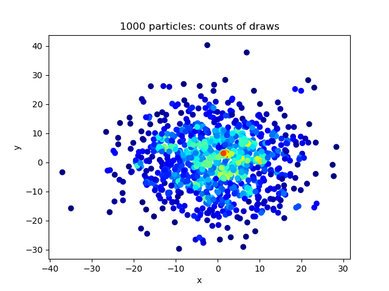

# Examples

## Simple

A simple example is `simple.py` that shows how to sample pairs of particles.

The main steps are:

1. Create particle positions. This should be a numpy array of dimensions `n x d`, where `n` is the number of particles and `d` is the dimension of each point (all dimensions 1D, 2D, 3D or higher are possible).

2. Create the probability calculator `ProbCalculator` object. This requires the particle positions, as well as two additional arguments:
  * `std_dev` - the standard deviation of the Gaussian.
  * `std_dev_clip_mult` - a multiplier for cutting off the probabilities. For a given particle, particles that are further than `std_dev_clip_mult * std_dev` away are not considered for draws.

  If this value is too low, only particles very close to each-other are considered for pairs, and the method is inaccurate (or fails). If this value is too high, the sampling is very inefficient, especially using rejection sampling since many particles far away from one another are considered as candidates.

  A good value here is e.g. `std_dev_clip_mult = 3`, such that `99.73%` of the full distribution is used.

3. Create the sampler `Sampler` object. This takes the `ProbCalculator` from the previous step.

4. Sample using:
  * Rejection sampling as follows:
  ```
  success = sampler.rejection_sample_pair_particles(no_tries_max)
  ```
  where `success` will be a Boolean, and `no_tries_max` is the number of tries before quitting.

  * Computing the CDF (i.e. through `numpy.random.choice` with weighted probabilities) as follows:
  ```
  success = sampler.cdf_sample_pair_particles()
  ```

## Drawing multiple pairs of particles in 1D

Drawing multiple pairs of particles in 1D space is shown in the `multiple_1d.py` file.

Histogram of 100 particle positions drawn from a uniform distribution:


Samples of 1000 pairs of particles (first particle on x axis; second particle on y axis; every point is a sampled pair). Naturally, it is symmetric about `y=x`.


## Varying the std. dev. for the Gaussian

The effect of varying the std. dev. for the Gaussian is shown in the `histograms_1d.py` file.

Histogram of 1000 particle positions drawn from a uniform distribution:


10000 draws for varying std. devs. (first particle on x axis; second particle on y axis; colors indictae number of draws). Naturally, it is symmetric about `y=x`.


## Drawing pairs in 2D

The module supports points in any spatial dimension, although samples are more difficult to visualize. The file `sample_2d.py` illustrates this in 2D.

1000 points in 2D space drawn from a Gaussian about 0, with colors indicating the the number of times a particle is included in a sampled pair, evaluated by performing 10000 draws.



For each particle, the average distance to the neighbor it was drawn with. At the outer edge, particles are not drawn because the chosen std. dev. (=1.0) is too small (for these particle, no other particle is close enough to be drawn). At the center, where many draws occur (see previous figure), the length scale is related to the chosen std. dev. of the Gaussian. As we move closer to the edge, the average distance between sampled pairs increases (although the count of draws for these particles decreases as shown in the previous figure) because particles become more sparse.


